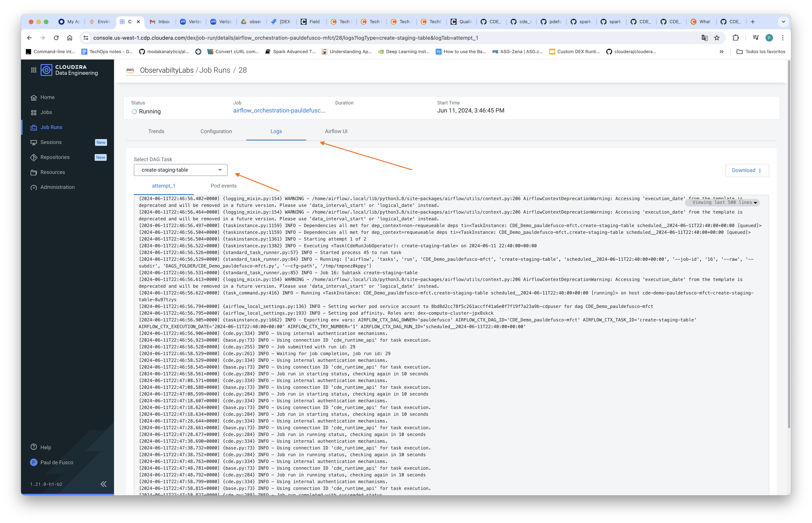
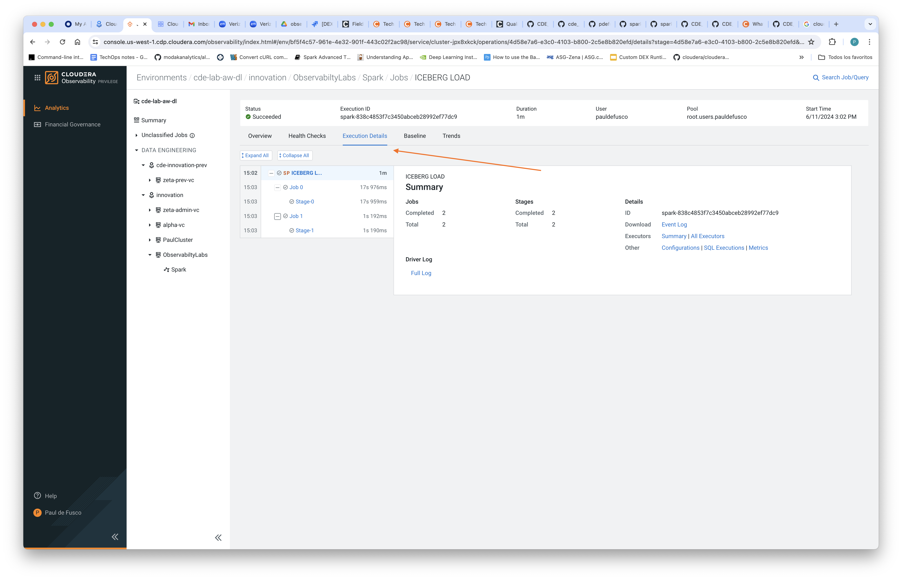
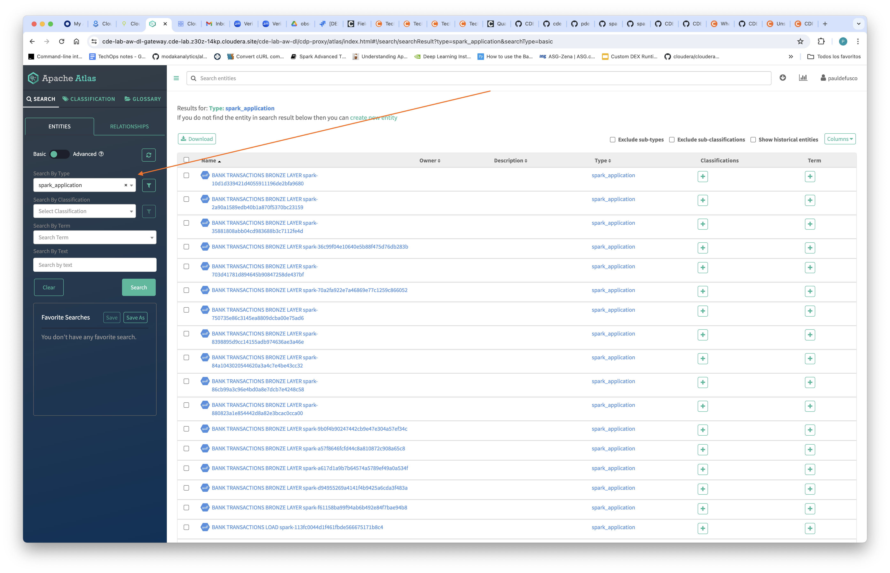

# Observabilidad de Jobs y Gobernanza de Datos

* [Lab 5: Monitoreo de Jobs con Cloudera Observability y CDE](https://github.com/pdefusco/CDE_121_HOL/blob/main/step_by_step_guides/spanish/part_03_observability.md#lab-5-monitoreo-de-jobs-con-cloudera-observability-y-cde)
* [Lab 6: Gobernanza de Jobs Spark con el CDP Data Catalog](https://github.com/pdefusco/CDE_121_HOL/blob/main/step_by_step_guides/spanish/part_03_observability.md#lab-6-gobernanza-de-jobs-spark-con-el-cdp-data-catalog)
* [Resumen](https://github.com/pdefusco/CDE_121_HOL/blob/main/step_by_step_guides/spanish/part_03_observability.md#resumen)
* [Enlaces y Recursos Útiles](https://github.com/pdefusco/CDE_121_HOL/blob/main/step_by_step_guides/spanish/part_03_observability.md#enlaces-y-recursos-útiles)

### Lab 5: Monitoreo de Jobs con Cloudera Observability y CDE

CDE ofrece una funcionalidad de observabilidad de jobs integrada, que incluye una interfaz de Job Runs, la interfaz de Airflow y la capacidad de descargar metadatos y registros de jobs a través de la API y CLI de CDE.

Cloudera Observability es un servicio de Cloudera que te ayuda a entender de manera interactiva tu entorno, servicios de datos, cargas de trabajo, clusters y recursos en todos los servicios de cómputo en un entorno CDP - ***incluyendo CDE***.

Cuando una carga de trabajo se completa, la información de diagnóstico sobre el job o la consulta y el cluster que los procesó es recopilada por Telemetry Publisher y enviada a Cloudera Observability, para que puedas optimizar tus consultas y pipelines a través de:

* Una amplia gama de métricas y pruebas de salud que te ayudan a identificar y resolver tanto problemas existentes como potenciales.
* Orientación y recomendaciones prescriptivas que te ayudan a abordar rápidamente esos problemas y optimizar soluciones.
* Referencias de rendimiento y análisis histórico que te ayudan a identificar y resolver problemas de rendimiento.

Además, Cloudera Observability también te permite:

* Mostrar visualmente los costos actuales e históricos de tu cluster de carga de trabajo, lo que te ayuda a planificar y prever presupuestos, futuros entornos de carga de trabajo y justificar los grupos y recursos de usuario actuales.
* Desencadenar acciones en tiempo real a través de jobs y consultas que te ayudan a tomar medidas para aliviar problemas potenciales.
* Habilitar la entrega diaria de las estadísticas de tu cluster a tu dirección de correo electrónico, lo que te ayuda a rastrear, comparar y monitorear sin tener que iniciar sesión en el cluster.
* Desglosar las métricas de tu carga de trabajo en vistas más significativas para tus necesidades comerciales, lo que te ayuda a analizar criterios específicos de carga de trabajo. Por ejemplo, puedes analizar cómo las consultas que acceden a una base de datos particular o que utilizan un pool de recursos específico están funcionando en relación con tus SLA. O puedes examinar cómo están funcionando todas las consultas en tu cluster que son enviadas por un usuario específico.

##### Monitorear Jobs en CDE

Navega al cluster virtual de CDE ObservabilityLabs. Abre la interfaz de Job Runs y observa que este cluster ya ha sido configurado con un pipeline de Airflow compuesto por tres jobs de Spark que cargan de manera incremental un nuevo lote de datos cada cinco minutos.

Selecciona el último Job Run del job llamado "airflow-orchestration-pauldefusco-mfct", abre la pestaña "Logs" y explora la salida de cada tarea de Airflow. Cada tarea corresponde a un CDEJobRunOperator en el código DAG de Airflow.

Luego, regresa a la página de Job Runs y explora el último Job Run para el job "iceberg_mergeinto-pauldefusco-mfct". Explora la pestaña Configuración, Logs y Spark UI.

* La pestaña Configuración almacena las dependencias y configuraciones del Job Spark.
* La pestaña Logs proporciona acceso a los registros de la aplicación Spark.
* La Spark UI ofrece visibilidad en la ejecución del Job Spark.

Todo esto se conserva en la interfaz de Job Runs de CDE para que los ingenieros de datos de CDE puedan validar fácilmente las ejecuciones pasadas y realizar un análisis complejo.

##### Monitorear Jobs en CDP Observability

Regresa de CDE a la página de inicio de CDP y luego abre CDP Observability. Expande el cluster ObservabilityLabs y luego la pestaña "Spark".

Explora las tendencias agregadas de los jobs. Nota que los jobs tardan cada vez más en ejecutarse. Esto se debe a que los datos se están cargando de manera incremental en la tabla Iceberg con una operación Merge Into que opera sobre una tabla que se está haciendo cada vez más grande.

Selecciona el job con la duración más larga y explora la pestaña Execution Details para encontrar información a nivel de Job Spark y Stage, y la pestaña Baseline para encontrar métricas de ejecución de Spark detalladas. En la pestaña Baseline, haz clic en el ícono "Show Abnormal Metrics" para identificar problemas potenciales con tu ejecución particular del job.

### Lab 6: Gobernanza de Jobs Spark con el CDP Data Catalog

El CDP Data Catalog es un servicio dentro de CDP que te permite entender, gestionar, asegurar y gobernar los activos de datos en toda la empresa. Data Catalog te ayuda a entender los datos a través de múltiples clusters y entornos CDP. Usando Data Catalog, puedes entender cómo se interpretan los datos para su uso, cómo se crean y modifican, y cómo se asegura y protege el acceso a los datos.

##### Explorar Jobs en Apache Atlas

Regresa a la página de inicio de CDP, abre Data Catalog y luego Atlas.

Atlas representa las metadatas como tipos y entidades, y proporciona capacidades de gestión y gobernanza de metadatos para que las organizaciones construyan, clasifiquen y gobiernen los activos de datos.

Busca "spark_applications" en la barra de búsqueda, luego selecciona una Aplicación Spark de la lista y explora sus metadatos.

En el panel de Clasificaciones, crea una nueva Clasificación de Metadatos. Asegúrate de usar un nombre único.

Regresa a la página principal, encuentra una aplicación Spark y ábrela. Luego aplica la Clasificación de Metadatos recién creada.

Finalmente, realiza una nueva búsqueda, esta vez usando la Clasificación que creaste para filtrar las Aplicaciones Spark.

### Resumen

Cloudera Observability es la solución de observabilidad de CDP, proporcionando una única vista para descubrir y recopilar continuamente telemetría de rendimiento a través de datos, aplicaciones y componentes de infraestructura en los despliegues de CDP en nubes privadas y públicas. Con análisis y correlaciones avanzadas e inteligentes, ofrece perspectivas y recomendaciones para abordar problemas complejos, optimizar costos y mejorar el rendimiento.

CDP Data Catalog es un servicio de gestión de metadatos en la nube que ayuda a las organizaciones a encontrar, gestionar y comprender sus datos en la nube. Es un repositorio centralizado que puede ayudar en la toma de decisiones basada en datos, mejorar la gestión de datos y aumentar la eficiencia operativa.

En esta sección final de los laboratorios, exploraste las capacidades de monitoreo de Job Runs en CDE. En particular, utilizaste la interfaz Job Runs de CDE para persistir metadatos de Job Runs, registros Spark y la Spark UI después de la ejecución. Luego, usaste CDP Observability para explorar métricas granulares de Job Runs y detectar anomalías. Finalmente, usaste CDP Data Catalog para clasificar las ejecuciones de jobs Spark con el fin de gobernar y buscar metadatos importantes de Job Runs.

### Enlaces y Recursos Útiles

* [Documentación de Cloudera Observability](https://docs.cloudera.com/observability/cloud/index.html)
* [CDP Data Catalog](https://docs.cloudera.com/data-catalog/cloud/index.html)
* [Documentación de Apache Atlas](https://docs.cloudera.com/cdp-reference-architectures/latest/cdp-ra-security/topics/cdp-ra-security-apache-atlas.html)
* [Documentación de Apache Ranger](https://docs.cloudera.com/cdp-reference-architectures/latest/cdp-ra-security/topics/cdp-ra-security-apache-ranger.html)
* [Monitoreo Eficiente de Jobs, Ejecuciones y Recursos con la CLI de CDE](https://community.cloudera.com/t5/Community-Articles/Monitoreo-Eficiente-de-Jobs-Ejecuciones-y-Recursos-con-la-CLI-de-CDE/ta-p/379893)

---
