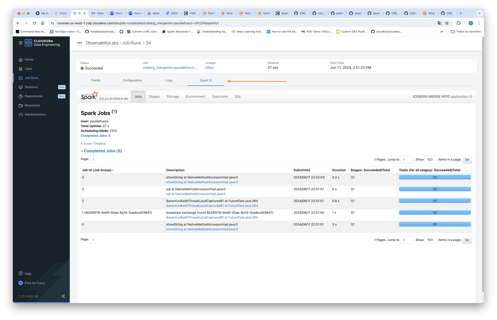
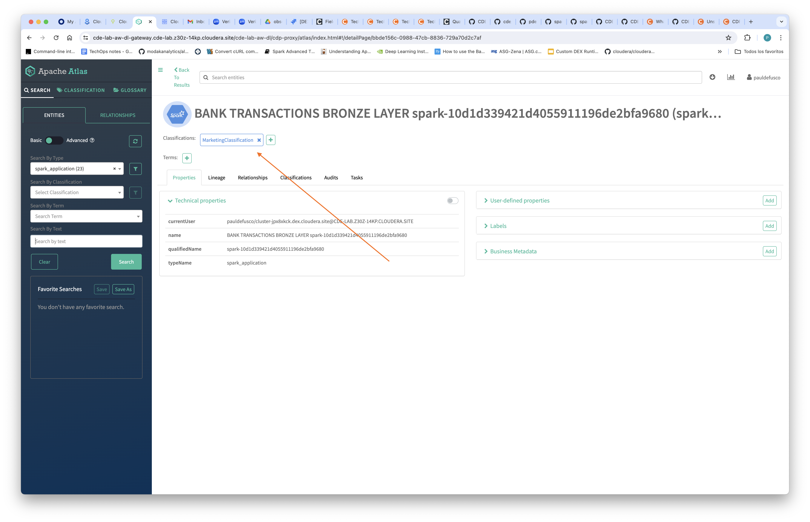

# Osservabilità dei Job e Governance dei Dati

* [Lab 5: Monitoraggio dei Job con Cloudera Observability e CDE](https://github.com/pdefusco/CDE_121_HOL/blob/main/step_by_step_guides/italian/part_03_observability.md#lab-5-monitoraggio-dei-job-con-cloudera-observability-e-cde)
* [Lab 6: Governance dei Job Spark con CDP Data Catalog](https://github.com/pdefusco/CDE_121_HOL/blob/main/step_by_step_guides/italian/part_03_observability.md#lab-6-governance-dei-job-spark-con-cdp-data-catalog)
* [Riepilogo](https://github.com/pdefusco/CDE_121_HOL/blob/main/step_by_step_guides/italian/part_03_observability.md#riepilogo)
* [Link e Risorse Utili](https://github.com/pdefusco/CDE_121_HOL/blob/main/step_by_step_guides/italian/part_03_observability.md#link-e-risorse-utili)

### Lab 5: Monitoraggio dei Job con Cloudera Observability e CDE

CDE offre una funzionalità integrata di osservabilità dei job, che include una UI per i Job Runs, la UI di Airflow e la possibilità di scaricare metadati e log dei job tramite API e CLI di CDE.

Cloudera Observability è un servizio di Cloudera che ti aiuta a comprendere in modo interattivo il tuo ambiente, i servizi di dati, i carichi di lavoro, i cluster e le risorse su tutti i servizi di calcolo in un ambiente CDP - ***incluso CDE***.

Quando un carico di lavoro è completato, le informazioni diagnostiche sul job o sulla query e sul cluster che li ha elaborati vengono raccolte da Telemetry Publisher e inviate a Cloudera Observability, in modo che tu possa ottimizzare le tue query e pipeline attraverso:

* Una vasta gamma di metriche e test di salute che ti aiutano a identificare e risolvere sia problemi esistenti che potenziali.
* Indicazioni e raccomandazioni prescriptive che ti aiutano ad affrontare rapidamente questi problemi e ottimizzare le soluzioni.
* Baseline di performance e analisi storiche che ti aiutano a identificare e risolvere i problemi di performance.

Inoltre, Cloudera Observability ti consente anche di:

* Visualizzare i costi attuali e storici del cluster di carico di lavoro, aiutandoti a pianificare e prevedere i budget, i futuri ambienti di carico di lavoro e giustificare i gruppi e le risorse utente attuali.
* Attivare azioni in tempo reale su job e query che ti aiutano a prendere misure per alleviare problemi potenziali.
* Abilitare la consegna quotidiana delle statistiche del tuo cluster al tuo indirizzo email, aiutandoti a monitorare, confrontare e seguire senza dover accedere al cluster.
* Suddividere le metriche del carico di lavoro in viste più significative per le tue esigenze aziendali, aiutandoti ad analizzare criteri specifici di carico di lavoro. Ad esempio, puoi analizzare come le query che accedono a un database particolare o che utilizzano un pool di risorse specifico stanno performando rispetto ai tuoi SLA. Oppure puoi esaminare come stanno performando tutte le query nel tuo cluster inviate da un utente specifico.

##### Monitorare i Job in CDE

Naviga verso il cluster virtuale di CDE ObservabilityLabs. Apri la UI di Job Runs e osserva che questo cluster è già stato configurato con un pipeline di Airflow composto da tre Job di Spark che caricano in modo incrementale un nuovo lotto di dati ogni cinque minuti.

Seleziona l'ultimo Job Run del job chiamato "airflow-orchestration-pauldefusco-mfct", apri la scheda "Logs" ed esplora l'output di ogni Task di Airflow. Ogni task corrisponde a un CDEJobRunOperator nel codice DAG di Airflow.

Successivamente, torna alla pagina di Job Runs ed esplora l'ultimo Job Run per il job "iceberg_mergeinto-pauldefusco-mfct". Esplora la scheda Configurazione, Logs e Spark UI.

* La scheda Configurazione memorizza le dipendenze e le configurazioni del Job Spark.
* La scheda Logs fornisce accesso ai log dell'applicazione Spark.
* La Spark UI offre visibilità sull'esecuzione del Job Spark.

Tutti questi dati sono conservati nella UI di Job Runs di CDE in modo che gli ingegneri dei dati di CDE possano facilmente convalidare le esecuzioni passate e eseguire una risoluzione dei problemi complessa.

##### Monitorare i Job in CDP Observability

Torna da CDE alla pagina principale di CDP e poi apri CDP Observability. Espandi il cluster ObservabilityLabs e poi la scheda "Spark".

Esplora le tendenze aggregate dei job. Nota che i job impiegano progressivamente più tempo per essere eseguiti. Questo perché i dati vengono caricati in modo incrementale nella tabella Iceberg con un'operazione Merge Into che opera su una tabella che sta diventando sempre più grande.

Seleziona il job con la durata più lunga ed esplora la scheda Execution Details per trovare informazioni a livello di Job Spark e Stage, e la scheda Baseline per trovare metriche di esecuzione di Spark dettagliate. Nella scheda Baseline, fai clic sull'icona "Show Abnormal Metrics" per identificare problemi potenziali con l'esecuzione specifica del job.

### Lab 6: Governance dei Job Spark con CDP Data Catalog

Il CDP Data Catalog è un servizio all'interno di CDP che ti consente di comprendere, gestire, proteggere e governare gli asset di dati in tutta l'azienda. Data Catalog ti aiuta a comprendere i dati attraverso più cluster e ambienti CDP. Utilizzando Data Catalog, puoi capire come i dati vengono interpretati per l'uso, come vengono creati e modificati e come viene garantito e protetto l'accesso ai dati.

##### Esplora i Job in Apache Atlas

Torna alla pagina principale di CDP, apri Data Catalog e poi Atlas.

Atlas rappresenta i metadati come tipi ed entità e fornisce capacità di gestione e governance dei metadati per consentire alle organizzazioni di costruire, classificare e governare gli asset di dati.

Cerca "spark_applications" nella barra di ricerca, poi seleziona un'Applicazione Spark dalla lista ed esplora i suoi metadati.

Nel pannello delle Classificazioni, crea una nuova Classificazione dei Metadati. Assicurati di usare un Nome unico.

Torna alla pagina principale, trova un'applicazione Spark e aprila. Poi applica la Classificazione dei Metadati appena creata.

Infine, esegui una nuova ricerca, questa volta utilizzando la Classificazione che hai creato per filtrare le Applicazioni Spark.

### Riepilogo

Cloudera Observability è la soluzione di osservabilità di CDP, fornendo una visione unica per scoprire e raccogliere continuamente telemetria di performance attraverso dati, applicazioni e componenti infrastrutturali nei deployment CDP su cloud privati e pubblici. Con analisi e correlazioni avanzate e intelligenti, offre intuizioni e raccomandazioni per affrontare problemi complessi, ottimizzare i costi e migliorare le performance.

CDP Data Catalog è un servizio di gestione dei metadati basato su cloud che aiuta le organizzazioni a trovare, gestire e comprendere i propri dati nel cloud. È un repository centralizzato che può aiutare nella presa di decisioni basate sui dati, migliorare la gestione dei dati e aumentare l'efficienza operativa.

In questa sezione finale dei laboratori, hai esplorato le capacità di monitoraggio dei Job Run in CDE. In particolare, hai utilizzato l'interfaccia Job Runs di CDE per mantenere i metadati dei Job Run, i log Spark e la Spark UI dopo l'esecuzione. Poi, hai utilizzato CDP Observability per esplorare le metriche granulari dei Job Run e rilevare anomalie. Infine, hai utilizzato CDP Data Catalog per classificare le esecuzioni dei job Spark al fine di governare e cercare metadati importanti dei job run.

### Link e Risorse Utili

* [Documentazione di Cloudera Observability](https://docs.cloudera.com/observability/cloud/index.html)
* [CDP Data Catalog](https://docs.cloudera.com/data-catalog/cloud/index.html)
* [Documentazione di Apache Atlas](https://docs.cloudera.com/cdp-reference-architectures/latest/cdp-ra-security/topics/cdp-ra-security-apache-atlas.html)
* [Documentazione di Apache Ranger](https://docs.cloudera.com/cdp-reference-architectures/latest/cdp-ra-security/topics/cdp-ra-security-apache-ranger.html)
* [Monitoraggio Efficiente dei Job, delle Esecuzioni e delle Risorse con la CLI di CDE](https://community.cloudera.com/t5/Community-Articles/Efficiently-Monitoring-Jobs-Runs-and-Resources-with-the-CDE/ta-p/379893)
