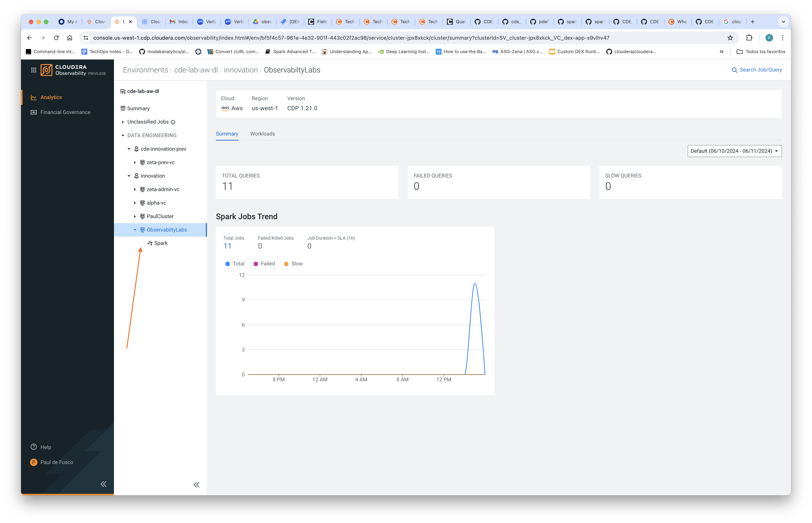
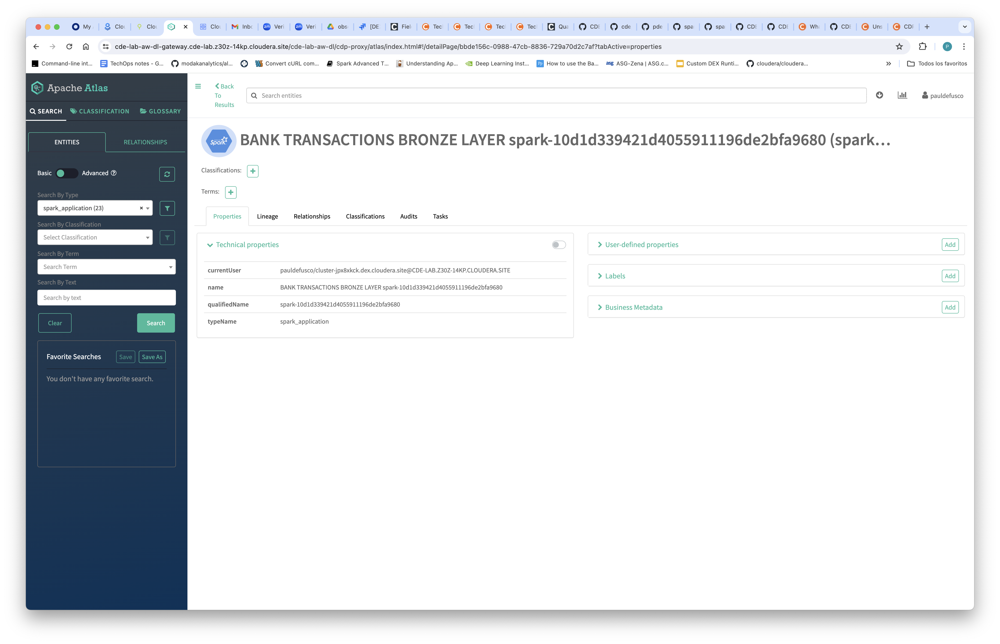
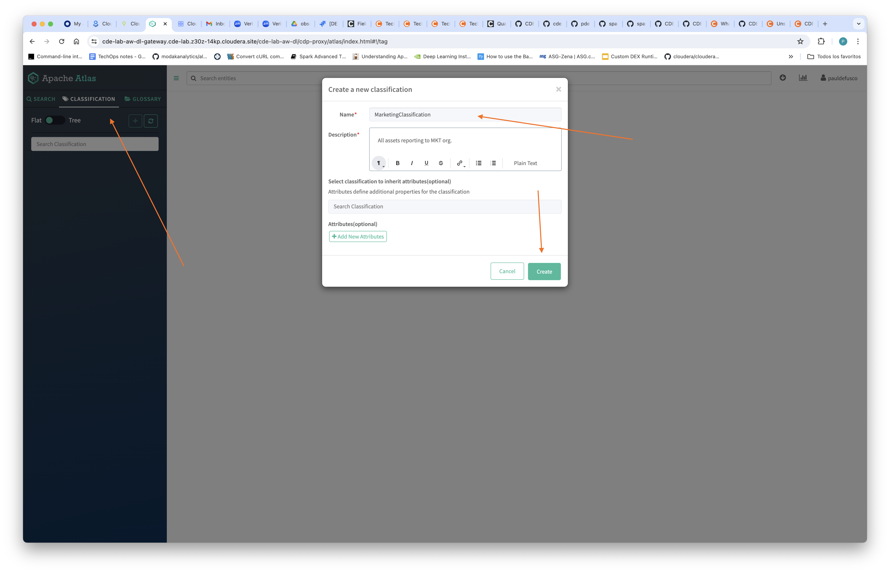
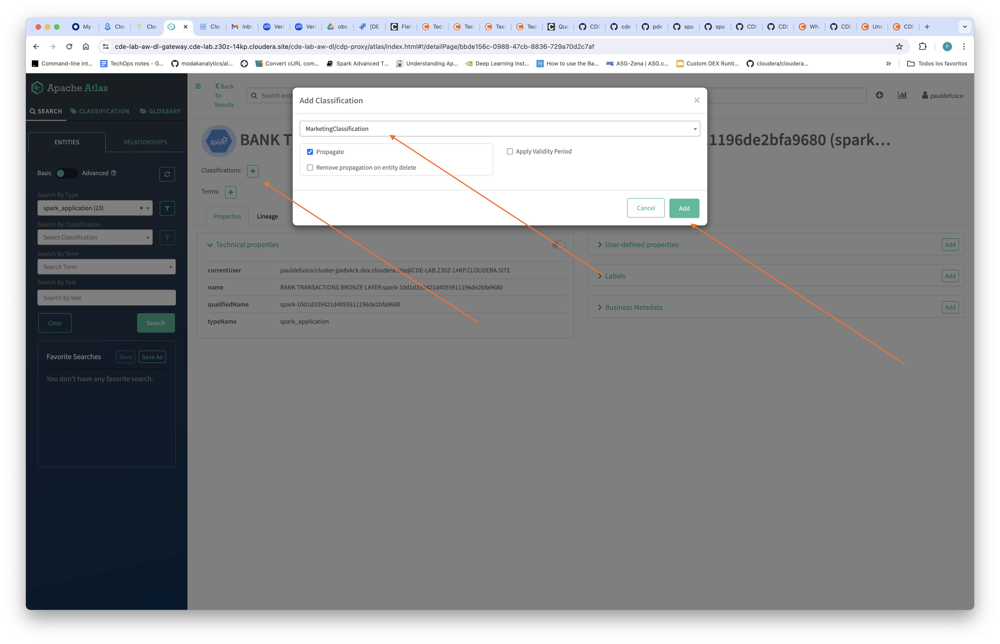

# Observabilidade de Jobs e Governança de Dados

* [Lab 5: Monitoramento de Jobs com Cloudera Observability e CDE](https://github.com/pdefusco/CDE_121_HOL/blob/main/step_by_step_guides/portuguese/part_03_observability.md#lab-5-monitoramento-de-jobs-com-cloudera-observability-e-cde)
* [Lab 6: Governança de Jobs Spark com CDP Data Catalog](https://github.com/pdefusco/CDE_121_HOL/blob/main/step_by_step_guides/portuguese/part_03_observability.md#lab-6-governanca-de-jobs-spark-com-cdp-data-catalog)
* [Resumo](https://github.com/pdefusco/CDE_121_HOL/blob/main/step_by_step_guides/portuguese/part_03_observability.md#resumo)
* [Links e Recursos Úteis](https://github.com/pdefusco/CDE_121_HOL/blob/main/step_by_step_guides/portuguese/part_03_observability.md#links-e-recursos-uteis)

### Lab 5: Monitoramento de Jobs com Cloudera Observability e CDE

O CDE oferece uma funcionalidade integrada de observabilidade de jobs, incluindo uma UI para Job Runs, a UI do Airflow e a capacidade de baixar metadados e logs dos jobs via API e CLI do CDE.

Cloudera Observability é um serviço da Cloudera que ajuda você a entender de forma interativa seu ambiente, serviços de dados, cargas de trabalho, clusters e recursos em todos os serviços de computação em um ambiente CDP - ***incluindo o CDE***.

Quando um carregamento de trabalho é concluído, informações diagnósticas sobre o job ou a consulta e o cluster que os processou são coletadas pelo Telemetry Publisher e enviadas para o Cloudera Observability, para que você possa otimizar suas consultas e pipelines através de:

* Uma ampla gama de métricas e testes de saúde que ajudam a identificar e solucionar problemas existentes e potenciais.
* Orientações e recomendações prescritivas que ajudam a resolver rapidamente esses problemas e otimizar soluções.
* Linhas de base de desempenho e análises históricas que ajudam a identificar e resolver problemas de desempenho.

Além disso, o Cloudera Observability também permite que você:

* Exiba visualmente os custos atuais e históricos do cluster de cargas de trabalho, ajudando a planejar e prever orçamentos, futuros ambientes de trabalho e justificar grupos e recursos de usuários atuais.
* Acione ações em tempo real em jobs e consultas que ajudam a tomar medidas para aliviar problemas potenciais.
* Habilite a entrega diária das estatísticas do seu cluster para seu endereço de e-mail, ajudando a rastrear, comparar e monitorar sem precisar fazer login no cluster.
* Divida as métricas do carregamento de trabalho em visualizações mais significativas para seus requisitos de negócios, ajudando a analisar critérios específicos de carregamento de trabalho. Por exemplo, você pode analisar como as consultas que acessam um banco de dados específico ou que usam um pool de recursos específico estão se saindo em relação aos seus SLAs. Ou você pode examinar como todas as consultas estão se saindo no seu cluster que são enviadas por um usuário específico.

##### Monitorar Jobs no CDE

Navegue até o cluster virtual CDE ObservabilityLabs. Abra a UI de Job Runs e observe que este cluster já foi configurado com um pipeline do Airflow composto por três Jobs do Spark que carregam incrementamente um novo lote de dados a cada cinco minutos.

Selecione o último Job Run do job chamado "airflow-orchestration-pauldefusco-mfct", abra a guia "Logs" e explore a saída de cada Task do Airflow. Cada tarefa corresponde a um CDEJobRunOperator no código DAG do Airflow.

Em seguida, volte para a página de Job Runs e explore o último Job Run para o job "iceberg_mergeinto-pauldefusco-mfct". Explore as guias Configuração, Logs e Spark UI.

* A guia Configuração armazena as dependências e configurações do Job Spark.
* A guia Logs fornece acesso aos logs da Aplicação Spark.
* A Spark UI oferece visibilidade na execução do Job Spark.

Todos esses dados são persistidos na UI de Job Runs do CDE para que os Engenheiros de Dados do CDE possam validar facilmente execuções passadas e realizar uma resolução de problemas complexa.

##### Monitorar Jobs no CDP Observability

Navegue de volta à página inicial do CDP e depois abra o CDP Observability. Expanda o cluster ObservabilityLabs e depois a guia "Spark".

Explore as tendências agregadas dos jobs. Note que os jobs estão progressivamente levando mais tempo para serem executados. Isso ocorre porque os dados estão sendo carregados incrementalmente na tabela Iceberg com uma operação Merge Into que opera em uma tabela que está ficando cada vez maior.

Selecione o job com a maior duração e explore a guia Execution Details para encontrar informações a nível de Job Spark e Stage, e a guia Baseline para encontrar métricas de execução do Spark detalhadas. Na guia Baseline, clique no ícone "Show Abnormal Metrics" para identificar problemas potenciais com sua execução específica do job.

### Lab 6: Governança dos Jobs Spark com CDP Data Catalog

O CDP Data Catalog é um serviço dentro do CDP que permite que você compreenda, gerencie, proteja e governe os ativos de dados em toda a empresa. O Data Catalog ajuda você a entender os dados através de vários clusters e ambientes CDP. Usando o Data Catalog, você pode entender como os dados são interpretados para uso, como são criados e modificados e como o acesso aos dados é protegido e garantido.

##### Explorar Jobs no Apache Atlas

Volte para a página inicial do CDP, abra o Data Catalog e depois o Atlas.

O Atlas representa os metadados como tipos e entidades e fornece capacidades de gerenciamento e governança de metadados para que as organizações construam, classifiquem e governem os ativos de dados.

Pesquise por "spark_applications" na barra de pesquisa, selecione uma Aplicação Spark da lista e explore seus metadados.

No painel de Classificações, crie uma nova Classificação de Metadados. Certifique-se de usar um Nome único.

Volte para a página principal, encontre uma aplicação Spark e abra-a. Então, aplique a Classificação de Metadados recém-criada.

Finalmente, faça uma nova pesquisa, desta vez usando a Classificação que você criou para filtrar as Aplicações Spark.

### Resumo

Cloudera Observability é a solução de observabilidade do CDP, fornecendo uma visão única para descobrir e coletar continuamente telemetria de desempenho em dados, aplicações e componentes de infraestrutura em implantações CDP em nuvens privadas e públicas. Com análises e correlações avançadas e inteligentes, oferece insights e recomendações para resolver problemas complexos, otimizar custos e melhorar o desempenho.

O CDP Data Catalog é um serviço de gerenciamento de metadados baseado em nuvem que ajuda as organizações a encontrar, gerenciar e entender seus dados na nuvem. É um repositório centralizado que pode ajudar na tomada de decisões baseadas em dados, melhorar o gerenciamento de dados e aumentar a eficiência operacional.

Nesta seção final dos laboratórios, você explorou as capacidades de monitoramento dos Job Runs no CDE. Em particular, você usou a UI de Job Runs do CDE para manter metadados dos Job Runs, logs do Spark e a Spark UI após a execução. Em seguida, você usou o CDP Observability para explorar métricas granulares dos Job Runs e detectar anomalias. Finalmente, você usou o CDP Data Catalog para classificar as execuções dos jobs Spark a fim de governar e pesquisar metadados importantes dos Job Runs.

### Links e Recursos Úteis

* [Documentação do Cloudera Observability](https://docs.cloudera.com/observability/cloud/index.html)
* [CDP Data Catalog](https://docs.cloudera.com/data-catalog/cloud/index.html)
* [Documentação do Apache Atlas](https://docs.cloudera.com/cdp-reference-architectures/latest/cdp-ra-security/topics/cdp-ra-security-apache-atlas.html)
* [Documentação do Apache Ranger](https://docs.cloudera.com/cdp-reference-architectures/latest/cdp-ra-security/topics/cdp-ra-security-apache-ranger.html)
* [Monitoramento Eficiente de Jobs, Execuções e Recursos com a CLI do CDE](https://community.cloudera.com/t5/Community-Articles/Efficiently-Monitoring-Jobs-Runs-and-Resources-with-the-CDE/ta-p/379893)
